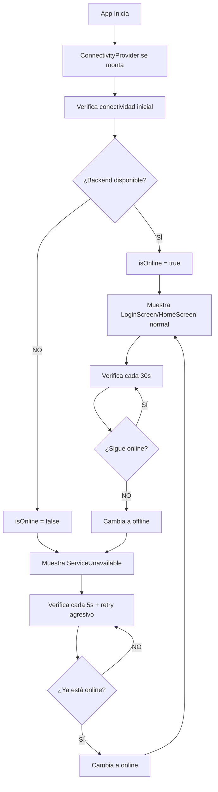

# 🔌 Sistema de Detección de Conectividad - Boston Tracker Mobile

## 📋 Resumen

Se ha implementado un sistema robusto de detección de conectividad que muestra un cartel grande "SERVICIO NO DISPONIBLE" cuando la aplicación móvil no puede conectarse al backend, y automáticamente habilita la aplicación cuando la conexión se restaura.

## 🏗️ Componentes Implementados

### 1. ConnectivityContext (`src/contexts/ConnectivityContext.js`)
- **Propósito**: Contexto React que maneja la detección de conectividad con el backend
- **Características**:
  - Verificación automática cada 30 segundos cuando está online
  - Verificación cada 5 segundos cuando está offline
  - Retry automático más agresivo cuando está desconectado
  - Usa el endpoint `/api/health` del backend para verificar conectividad
  - Expone estado de conectividad a toda la aplicación

### 2. ServiceUnavailable (`src/components/ServiceUnavailable.js`)
- **Propósito**: Pantalla de servicio no disponible con diseño atractivo
- **Características**:
  - Mensaje claro y visible "SERVICIO NO DISPONIBLE"
  - Botón para reintentar manualmente
  - Indicador de última verificación
  - Información sobre reconexión automática
  - Diseño consistente con la marca Boston

### 3. Integración en Pantallas
- **LoginScreen**: Muestra ServiceUnavailable si no hay conectividad
- **HomeScreen**: Muestra ServiceUnavailable si no hay conectividad
- **App.js**: ConnectivityProvider envuelve toda la aplicación

## 🔄 Flujo de Funcionamiento



## ⚙️ Configuración Técnica

### Intervalos de Verificación
- **Online**: 15 segundos (más frecuente para detección rápida)
- **Offline**: 3 segundos (verificación agresiva)
- **Retry automático**: 1 segundo (respuesta inmediata)

### Endpoint Utilizado
- **URL**: `GET /api/health`
- **Timeout**: 10 segundos (configurado en apiService)
- **Respuesta esperada**: 
  ```json
  {
    "status": "OK",
    "message": "Boston Tracker API funcionando (PostgreSQL)",
    "timestamp": "2025-08-26T16:13:35.024Z"
  }
  ```

### Estados del Contexto
```javascript
{
  isOnline: boolean,     // true si backend está disponible
  isChecking: boolean,   // true durante verificaciones
  lastCheckTime: Date,   // timestamp de última verificación
  forceCheck: function   // función para verificar manualmente
}
```

## 🎯 Características del Sistema

### ✅ Lo que SÍ hace:
- ✅ **Deteción automática**: Detecta cuando el backend no está disponible
- ✅ **Pantalla clara**: Muestra "SERVICIO NO DISPONIBLE" de forma prominente
- ✅ **Reconexion automática**: Se reconecta cuando el backend vuelve
- ✅ **Detección inmediata**: Cualquier error de API activa verificación rápida
- ✅ **Verificación agresiva**: Intervalos cortos cuando está offline (3s)
- ✅ **Retry manual**: Botón para verificar manualmente
- ✅ **Info temporal**: Muestra cuándo fue la última verificación
- ✅ **StatusBar arreglado**: Sin warnings de backgroundColor
- ✅ **Logs mejorados**: Mensajes menos alarmantes para Socket.io
- ✅ **Interceptor de errores**: Detecta errores de cualquier API call

### 🔧 Lo que se podría mejorar:
- 🔄 Detección de conectividad de red local (WiFi/datos móviles)
- 🔄 Notificaciones push cuando se restaura la conexión
- 🔄 Cache local para funcionalidad offline limitada
- 🔄 Métricas de tiempo de inactividad

## 🧪 Cómo Probar

### Prueba Automática
```bash
node test-connectivity.js
```

### Prueba Manual
1. **Iniciar aplicación móvil** - debería funcionar normalmente
2. **Detener backend** - la app debería mostrar "SERVICIO NO DISPONIBLE" en pocos segundos
3. **Reiniciar backend** - la app debería volver a funcionar automáticamente
4. **Probar botón "Reintentar"** - debería acelerar la verificación

### Verificación del Backend
```bash
curl http://192.168.1.36:5000/api/health
```

## 📱 Experiencia del Usuario

### Cuando TODO funciona:
- La aplicación funciona normalmente
- El usuario no ve ningún mensaje de conectividad
- Las verificaciones ocurren silenciosamente en segundo plano

### Cuando NO HAY conexión:
- Pantalla completa con mensaje claro "SERVICIO NO DISPONIBLE"
- Logo de Boston visible para mantener identidad de marca
- Botón para reintentar manualmente
- Información de cuándo fue la última verificación
- Mensaje tranquilizador que se reconectará automáticamente

### Cuando se RESTAURA la conexión:
- Transición automática a la pantalla normal
- Sin necesidad de recargar o reiniciar la app
- Continuidad en la experiencia del usuario

## 🔗 Archivos Modificados

1. **Nuevos archivos**:
   - `src/contexts/ConnectivityContext.js`
   - `src/components/ServiceUnavailable.js`
   - `test-connectivity.js`
   - `CONECTIVIDAD.md`

2. **Archivos modificados**:
   - `App.js` - Agregado ConnectivityProvider
   - `src/screens/LoginScreen.js` - Integración con conectividad
   - `src/screens/HomeScreen.js` - Integración con conectividad

## 🎉 Resultado Final

La aplicación móvil ahora tiene un sistema robusto que:
- **Detecta automáticamente** cuando el backend no está disponible
- **Muestra una pantalla clara** en lugar de errores confusos
- **Se reconecta automáticamente** cuando el servicio se restaura
- **Mantiene una experiencia de usuario profesional** incluso durante problemas de conectividad

¡El sistema está listo para producción y proporciona una excelente experiencia de usuario!
