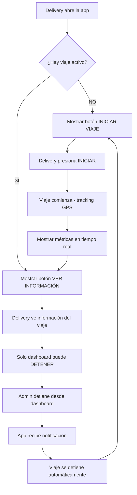

# 🎯 Control de Viajes - Boston Tracker Mobile

## 📋 Cambio Implementado

Se ha modificado la aplicación móvil para que **los delivery solo puedan INICIAR viajes**, pero **NO puedan detenerlos**. Solo los administradores desde el dashboard web pueden detener los viajes.

## 🔄 Flujo de Control

## 🎛️ Cambios Realizados

### 1. **Botón Principal Modificado**
- **Antes**: 
  - Sin viaje: "▶️ Iniciar Viaje" 
  - Con viaje: "⏹️ Detener Viaje" (❌ REMOVIDO)
- **Ahora**:
  - Sin viaje: "▶️ Iniciar Viaje" ✅
  - Con viaje: "📊 Ver Información del Viaje" ✅

### 2. **Nueva Funcionalidad de Información**
Cuando hay un viaje activo, el botón muestra un **popup informativo** con:
- 📍 Distancia recorrida actual
- ⏱️ Tiempo transcurrido 
- ℹ️ Mensaje: "Solo el administrador puede detener el viaje desde el dashboard"

### 3. **Información Actualizada**
Se agregó un nuevo bullet point en la sección de información:
- "• Solo el administrador desde el dashboard puede detener tus viajes"

### 4. **Colores y Diseño**
- **Botón Iniciar**: Verde (`#28a745`) ✅
- **Botón Información**: Azul turquesa (`#17a2b8`) 📊
- Mantiene el diseño consistente con la marca Boston

## 🔐 Control de Acceso

### ✅ **Lo que SÍ pueden hacer los deliverys:**
- ✅ **Iniciar viajes** - Control total sobre cuándo empezar a trabajar
- ✅ **Ver métricas en tiempo real** - Distancia y tiempo recorrido
- ✅ **Ver información del viaje** - Estado actual detallado
- ✅ **Recibir notificaciones** - Cuando el admin detiene el viaje
- ✅ **Sincronización automática** - Los datos se actualizan en tiempo real

### ❌ **Lo que NO pueden hacer los deliverys:**
- ❌ **Detener viajes** - Solo administradores
- ❌ **Modificar datos del viaje** - Solo lectura
- ❌ **Cancelar viajes** - Solo administradores
- ❌ **Editar métricas** - Automáticas y protegidas

## 🎯 Beneficios Operativos

### **Para los Administradores:**
- 🎛️ **Control total** sobre cuándo terminan los viajes
- 📊 **Supervisión completa** de todos los deliverys
- ⏱️ **Control de horas** trabajadas
- 📈 **Métricas precisas** sin manipulación
- 🚨 **Prevención de finalizaciones prematuras**

### **Para los Deliverys:**
- 🚀 **Inicio flexible** - Pueden comenzar cuando estén listos
- 📱 **Interfaz simple** - Sin botones confusos de detener
- 📊 **Información clara** - Siempre saben el estado actual
- ⚡ **Funcionamiento automático** - No necesitan gestionar el final

### **Para la Operación:**
- 📋 **Proceso estandarizado** - Todos los viajes se gestionan igual
- 🔄 **Flujo controlado** - Inicio libre, finalización supervisada  
- 📈 **Datos confiables** - Sin manipulación por parte de deliverys
- ⚙️ **Administración centralizada** - Todo desde el dashboard

## 🧪 Cómo Funciona

### **Iniciando un Viaje:**
1. Delivery abre la app
2. Ve botón verde "▶️ Iniciar Viaje"  
3. Presiona el botón
4. Confirma en el popup
5. GPS comienza a tracking
6. Métricas se actualizan en tiempo real

### **Durante el Viaje:**
1. Delivery ve botón azul "📊 Ver Información del Viaje"
2. Puede presionarlo para ver:
   - Distancia actual recorrida
   - Tiempo transcurrido
   - Mensaje sobre control administrativo
3. Las métricas se actualizan automáticamente
4. Los datos se sincronizan con el dashboard

### **Deteniendo un Viaje:**
1. **Solo el administrador** desde el dashboard web puede detener
2. Admin presiona "Detener" en el dashboard
3. La app móvil **recibe automáticamente** la notificación
4. Se muestra popup: "🛑 Viaje Detenido" con resumen
5. Delivery presiona "Entendido"
6. App vuelve al estado inicial (botón Iniciar disponible)

## 📱 Experiencia del Usuario

### **Inicio de Turno:**
- Delivery abre la app → Ve claramente "Iniciar Viaje" → Un tap y listo

### **Durante el Trabajo:**
- Ve métricas en tiempo real → No se preocupa por detener → Se enfoca en las entregas

### **Fin de Turno:**
- El admin desde oficina detiene el viaje → Notification automática → Proceso completado

## 🎉 Resultado Final

La aplicación ahora tiene un **control de flujo perfecto**:

- **Inicio libre** ✅ - Los deliverys pueden empezar cuando estén listos
- **Seguimiento automático** ✅ - Todo se registra sin intervención
- **Finalización controlada** ✅ - Solo administradores deciden cuándo terminar
- **Información transparente** ✅ - Todos saben cómo funciona el sistema

¡Esto garantiza datos precisos, control operativo y una experiencia de usuario clara y sin confusiones!
